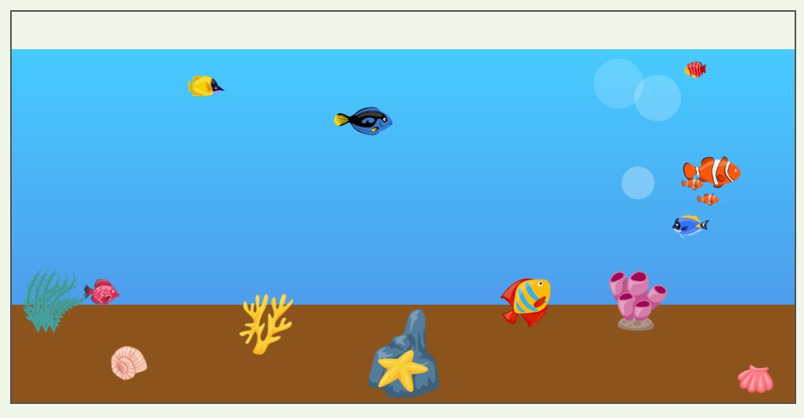

# Virtual Aquarium

[](https://developer.mozilla.org/en-US/docs/Web/HTML)
[](https://developer.mozilla.org/en-US/docs/Web/CSS)
[](https://developer.mozilla.org/en-US/docs/Web/CSS/CSS_animations)

An animated virtual aquarium created with HTML and CSS. The aquarium features swimming fish, rising bubbles, coral reefs, shells, a starfish, and other underwater decorations, creating a vibrant aquatic scene.

---

## Preview



---

## Features

- Animated fish swimming at different speeds and directions
- Bubble and water animation effects
- Decorative coral, shells, starfish, and underwater decorations
- Interactive hover effects on aquatic elements

---

## Technologies

| Technology                                                                                                                                                              | Description                                     |
| ----------------------------------------------------------------------------------------------------------------------------------------------------------------------- | ----------------------------------------------- |
| [](https://developer.mozilla.org/en-US/docs/Web/HTML)                                     | Page structure and aquarium content             |
| [](https://developer.mozilla.org/en-US/docs/Web/CSS)                                         | Layout, styling, and visual design              |
| [](https://developer.mozilla.org/en-US/docs/Web/CSS/CSS_animations)    | Fish, bubbles, water, and decoration animations |
| [](https://developer.mozilla.org/en-US/docs/Web/CSS/CSS_transitions) | Smooth hover and interaction effects            |

---

## Project Structure

```text
Aquarium/
├── aquarium.html   # Structure and content for the aquarium
├── aquarium.css    # Layout, styling, animations, and interactions
├── images/         # Fish and underwater decoration images
└── README.md       # Project documentation
```

---

## Getting Started

1. Clone the repository.
2. Open `index.html` in a web browser.

No build tools or dependencies are required.

---

## Live Demo

[View the live virtual aquarium demo](https://pritam-exam-project.github.io/aquarium/)

---

## Academic Project

Created as a part of the **Kreativt Webprosjekt** course at **Høyskolen Kristiania**.

- Semester: Autumn 2024
- Course: [Kreativt Webprosjekt](https://www.kristiania.no/studier/nettstudier/enkeltemne/kreativt-webprosjekt/)

---
